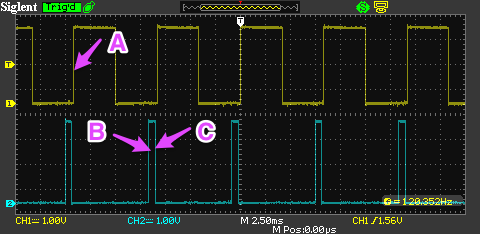
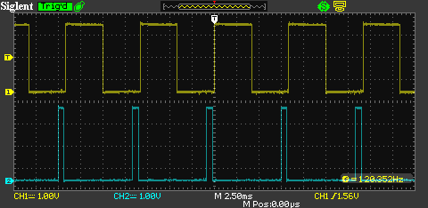
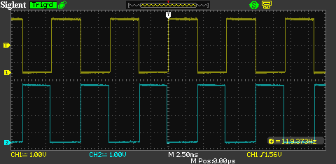
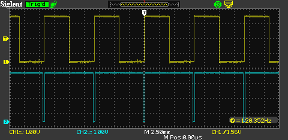
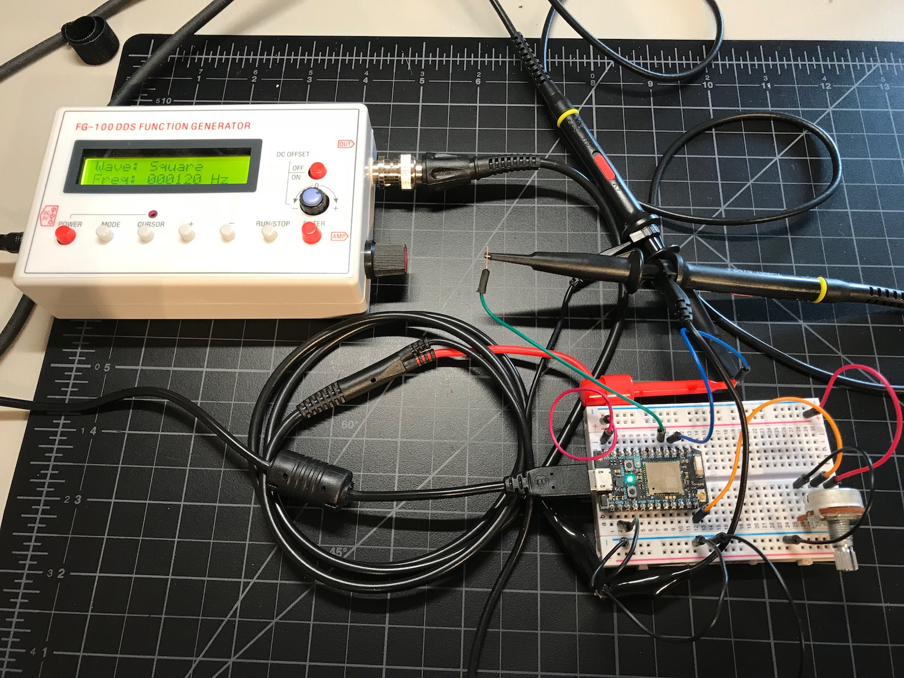

# Photon Dimmer Example

*Example code for implementing a pulse width modulation dimmer on the Photon*

**Note: Working with high voltages is extremely dangerous. There is a high risk of electrocuting someone or starting a fire. Do not ask me how to wire up the zero-crossing detector and triac. I will ignore your request, as if you don't know that, you should not be messing with high voltages.**

When implementing a dimmer, you normally have two things:

- A zero-crossing detector
- A [triac](https://en.wikipedia.org/wiki/TRIAC) to control the load

The way the dimmer works is that you wait an amount of time after zero-crossing, then turn on the triac. The triac turns itself off when the alternating current next reaches zero.

The simulated zero-crossing detector is the top channel (yellow). The rising edge A marks a zero crossing. The next rising edge marks the next zero crossing. The frequency is 120 Hz., simulating both the upper and lower halves of a 60 Hz signal.

The dimmed signal is on the bottom channel (blue). B is the programmed phase delay from A. The light would turn on here. C is where the triac is turned off. It must be turned off before the next zero-crossing.

Here are waveforms for dim (mostly off):

Medium or half bright:

Bright, almost completely on:

While you could do this using software interrupts, things like interrupt latency can cause issues. The technique here does it entirely with hardware timers.

**Note: This is extremely experimental. It may not work and relies on directly accessing hardware on the STM32F205 and may break in the future.**

## The test circuit

In the test circuit:

- A potentiometer is connected to 3V3 and GND on the outside terminals and A0 on the center terminal. This is the brightness control.
- D3 is the variable pulse output. This would go to the triac.
- D2 is the zero-crossing detector. The rising edge of this signal indicates zero-crossing.

Instead of actually using a zero-crossing detector, I just simulated it here with a 120 Hz square wave. 

## The code

The code should be relatively straightforward. There are a lot of comments, so just read those.

## Other resources

- [STM32F205 data sheet](https://www.st.com/content/ccc/resource/technical/document/datasheet/bc/21/42/43/b0/f3/4d/d3/CD00237391.pdf/files/CD00237391.pdf/jcr:content/translations/en.CD00237391.pdf)
- [STM32F2xx standard library](https://www.st.com/content/ccc/resource/technical/document/user_manual/59/2d/ab/ad/f8/29/49/d6/DM00023896.pdf/files/DM00023896.pdf/jcr:content/translations/en.DM00023896.pdf)
- [STM32F2xx Reference](https://www.st.com/content/ccc/resource/technical/document/reference_manual/51/f7/f3/06/cd/b6/46/ec/CD00225773.pdf/files/CD00225773.pdf/jcr:content/translations/en.CD00225773.pdf)
